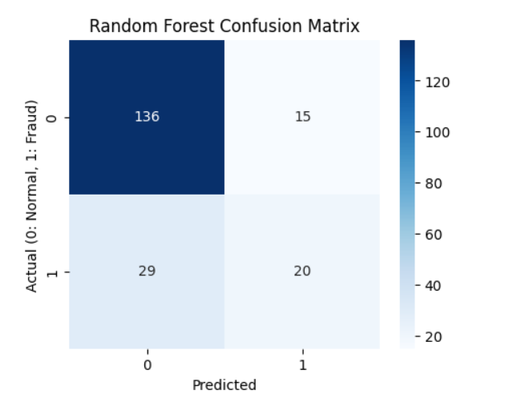
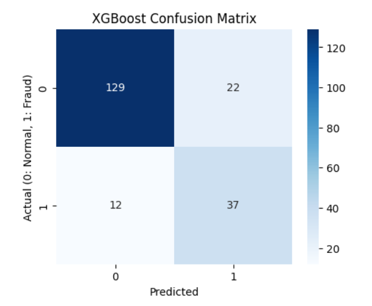
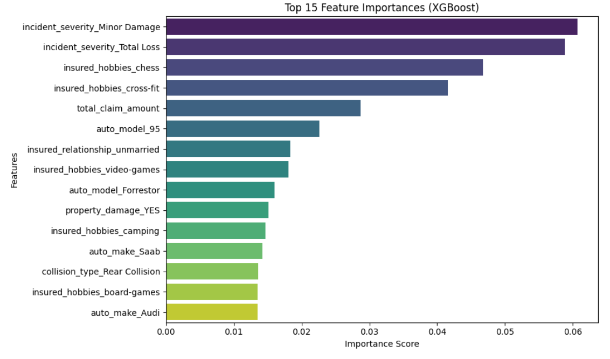

# Insurance Claims Fraud Risk Analytics

## Project Overview

This project builds an end-to-end machine learning workflow to identify potentially fraudulent auto insurance claims using policy, customer, vehicle, incident, and claim-related information.

The goal of this project is not only to train classification models, but also to support business-oriented fraud risk analysis. The model results can help prioritize suspicious claims for further manual review and support data-driven decision-making in insurance claim investigation.

## Dataset

The dataset used in this project is an auto insurance claims fraud detection dataset from Kaggle.

The target variable is:

- `fraud_reported`
  - `Y`: Fraudulent claim
  - `N`: Non-fraudulent claim

The dataset includes information such as:

- Policy details
- Customer information
- Incident details
- Vehicle information
- Claim amounts
- Property damage information
- Police report availability
- Fraud reporting status

## Tools and Technologies

- Python
- pandas
- NumPy
- scikit-learn
- XGBoost
- matplotlib
- seaborn
- Kaggle Notebook environment

## Project Workflow

### 1. Data Loading

The notebook automatically searches the Kaggle input directory and loads the first available CSV file.

```python
csv_files = glob.glob('/kaggle/input/**/*.csv', recursive=True)
file_path = csv_files[0]
df = pd.read_csv(file_path)
```

This makes the notebook easier to run in the Kaggle environment without manually typing the dataset path.

### 2. Data Cleaning

Missing values represented by `?` are replaced with `NaN`.

```python
df.replace('?', np.nan, inplace=True)
```

The following categorical columns are filled using their most frequent values:

- `collision_type`
- `property_damage`
- `police_report_available`

Using the mode helps preserve useful records instead of removing rows with missing claim-related information.

### 3. Feature Engineering

Two additional business-relevant features are created from the original dataset.

#### Policy Age

```python
policy_age_days = incident_date - policy_bind_date
```

This feature represents the number of days between the policy binding date and the incident date. It may help capture suspicious claims that occur shortly after a policy becomes active.

#### Vehicle Age

```python
vehicle_age = incident_year - auto_year
```

This feature represents the age of the vehicle at the time of the incident.

After creating these features, redundant identifiers and raw date columns are removed:

- `policy_number`
- `policy_bind_date`
- `incident_date`
- `incident_location`
- `auto_year`
- `incident_year`
- `_c39`

### 4. Target Encoding

The target variable `fraud_reported` is converted into binary format:

```text
Y -> 1
N -> 0
```

Where:

- `1` represents a fraudulent claim
- `0` represents a normal claim

### 5. Categorical Encoding

Categorical variables are converted using one-hot encoding.

```python
df = pd.get_dummies(df, columns=cat_cols, drop_first=True)
```

One-hot encoding is used instead of label encoding to avoid assigning artificial ordinal relationships to categorical values.

### 6. Train-Test Split

The dataset is split into training and testing sets using an 80/20 split.

```python
train_test_split(
    X,
    y,
    test_size=0.2,
    random_state=42,
    stratify=y
)
```

A stratified split is used to maintain a similar fraud/non-fraud ratio in both the training and testing sets.

### 7. Feature Scaling

Numerical features are standardized using Z-score normalization.

```python
StandardScaler()
```

Feature scaling helps ensure that numerical variables are on a comparable scale before model training.

### 8. Model Training

Two classification models are trained and compared.

#### Random Forest Classifier

```python
RandomForestClassifier(
    n_estimators=100,
    random_state=42,
    max_depth=10,
    class_weight='balanced'
)
```

The `class_weight='balanced'` parameter is used to help address class imbalance.

#### XGBoost Classifier

```python
XGBClassifier(
    n_estimators=100,
    learning_rate=0.05,
    random_state=42,
    eval_metric='logloss',
    scale_pos_weight=pos_weight
)
```

The `scale_pos_weight` parameter is used to help XGBoost handle the imbalanced fraud classification problem.

## Model Evaluation

The models are evaluated using the following metrics:

- Accuracy
- Precision
- Recall
- F1-score
- ROC-AUC
- PR-AUC
- Confusion matrix

Since fraud detection is usually an imbalanced classification problem, accuracy alone is not enough. This project also considers recall, F1-score, ROC-AUC, and PR-AUC to better evaluate model performance on fraudulent claims.

## Results

### Confusion Matrix Comparison

The confusion matrices below compare the Random Forest and XGBoost models on the test set.

### Random Forest Confusion Matrix



The Random Forest model correctly classified 136 normal claims and 20 fraudulent claims. However, it missed 29 fraudulent claims.

This means that although the model performed reasonably well on normal claims, its ability to detect fraudulent claims was more limited.

### XGBoost Confusion Matrix



The XGBoost model correctly classified 129 normal claims and 37 fraudulent claims. It missed only 12 fraudulent claims.

Compared with Random Forest, XGBoost performed better at identifying actual fraud cases, which is especially important in insurance fraud detection.

## Model Comparison

| Model | Accuracy | Fraud Precision | Fraud Recall | Fraud F1-score |
|---|---:|---:|---:|---:|
| Random Forest | 0.78 | 0.57 | 0.41 | 0.48 |
| XGBoost | 0.83 | 0.63 | 0.76 | 0.69 |

Based on the confusion matrices, XGBoost performed better overall, especially in detecting fraudulent claims.

The XGBoost model achieved a higher fraud recall, meaning it was more effective at identifying actual fraud cases. This is valuable in an insurance claim review setting because missing fraudulent claims can be more costly than flagging some normal claims for manual review.

## Feature Importance Analysis

The XGBoost model is used to generate feature importance scores. The top 15 most important features are visualized below.



The feature importance chart shows that several important variables contributed to the fraud prediction model, including:

- Incident severity
- Total claim amount
- Property damage
- Collision type
- Selected customer-related and vehicle-related attributes

These features can help analysts understand which claim characteristics the model relied on most when estimating fraud risk.

### Important Note on Interpretation

Feature importance should be interpreted carefully. It shows which variables were useful for the model, but it does not prove that these variables directly cause fraud.

For example, some categorical variables such as hobbies or vehicle models may reflect patterns specific to this public dataset rather than general insurance fraud behavior. In a real business environment, these features would require further validation before being used in operational decision-making.

## Business Value

This project demonstrates how machine learning can support insurance fraud risk analysis by:

- Identifying potentially suspicious claims
- Prioritizing claims for manual investigation
- Supporting fraud review teams with data-driven insights
- Reducing unnecessary review workload
- Comparing model performance using fraud-specific metrics
- Explaining important risk drivers through feature importance analysis

## Project Structure

```text
insurance-claims-fraud-risk-analytics/
│
├── README.md
├── insurance_fraud_analysis.ipynb
├── random_forest_confusion_matrix.png
├── xgboost_confusion_matrix.png
└── xgboost_feature_importance.png
```

## How to Run

### Option 1: Run on Kaggle

1. Open a Kaggle Notebook.
2. Add the auto insurance claims fraud dataset as an input.
3. Copy or upload the notebook code.
4. Run all cells in order.

The notebook automatically searches for CSV files inside:

```python
/kaggle/input/
```

### Option 2: Run Locally

If running locally, update the dataset path manually:

```python
file_path = "your_local_dataset_path.csv"
df = pd.read_csv(file_path)
```

Then install the required libraries:

```bash
pip install pandas numpy matplotlib seaborn scikit-learn xgboost
```

Run the notebook or Python script.

## Requirements

```txt
pandas
numpy
matplotlib
seaborn
scikit-learn
xgboost
jupyter
```

## Limitations

This project is designed as a machine learning analytics project using a public dataset. In a real insurance business environment, additional validation, governance, fairness review, and monitoring would be required before using the model in production.

Some limitations include:

- The dataset is relatively small.
- Some categorical variables may reflect dataset-specific patterns.
- Feature importance does not prove causation.
- The model has not been tuned using cross-validation.
- Business costs of false positives and false negatives are not explicitly modeled.

## Future Improvements

Possible future improvements include:

- Hyperparameter tuning using cross-validation
- Threshold adjustment based on fraud investigation cost
- SHAP analysis for stronger model explainability
- Comparison with logistic regression as an interpretable baseline model
- More advanced feature engineering
- Model monitoring for data drift
- Power BI or Tableau dashboard for business reporting
- Cost-sensitive evaluation for fraud investigation decisions

## Skills Demonstrated

- Data cleaning
- Missing value handling
- Feature engineering
- One-hot encoding
- Train-test splitting
- Feature scaling
- Imbalanced classification handling
- Random Forest modeling
- XGBoost modeling
- Model evaluation
- Confusion matrix visualization
- Feature importance analysis
- Business-oriented fraud risk interpretation

## Summary

This project presents an end-to-end machine learning workflow for auto insurance claims fraud detection. It combines data preprocessing, feature engineering, classification modeling, performance evaluation, and feature importance analysis to support fraud risk review and insurance claim investigation prioritization.

The results show that XGBoost performed better than Random Forest in detecting fraudulent claims, especially in terms of fraud recall and F1-score. This makes it a stronger model candidate for prioritizing suspicious claims for further review.
